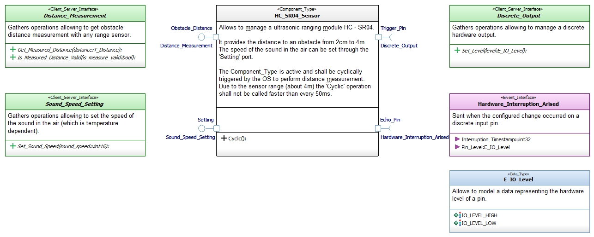

# HC_SR04_Sensor

This repository defines software elements allowing to manage an ultrasonic ranging module HC - SR04.

Modeled using the [Software_Model_Toolset](https://github.com/HomeMadeRobots/Software_Model_Toolset).

Implemented using the [Embedded_C_Framework](https://github.com/HomeMadeRobots/Embedded_C_Framework).

## Description

Allows to manage an ultrasonic ranging module HC - SR04.

It provides the distance to an obstacle from 2cm to 4m.
The speed of the sound in the air can be set through the 'Setting' port.

The Component_Type is active and shall be cyclically triggered by the OS to perform distance measurement.
Due to the sensor range (about 4m) the 'Cyclic' operation shall not be called faster than every 50ms.

## Needed repositories

This repo use the following repositories :
- [Embedded_C_Framework](https://github.com/HomeMadeRobots/Embedded_C_Framework) (*Delay.h*)
- [Geometrics_Interfaces](https://github.com/HomeMadeRobots/Geometrics_Interfaces)
- [Hardware_IO_Interfaces](https://github.com/HomeMadeRobots/Hardware_IO_Interfaces)

## Physical software architecture

## Internal design

See [wiki](https://github.com/HomeMadeRobots/HC_SR04_Sensor/wiki/HC_SR04_Sensor-internal-design).